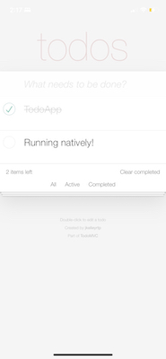
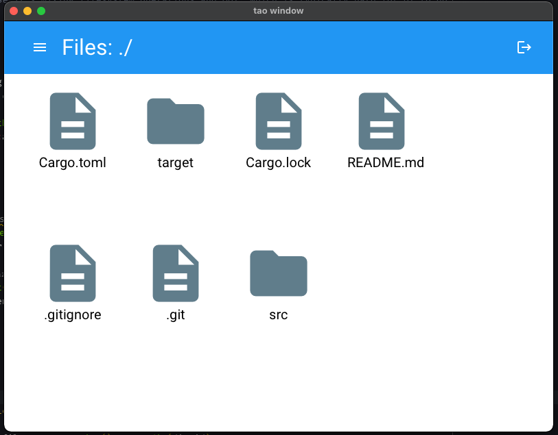
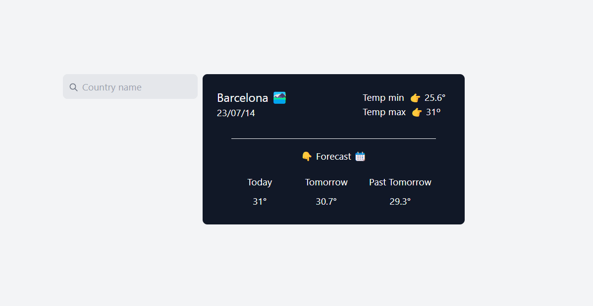
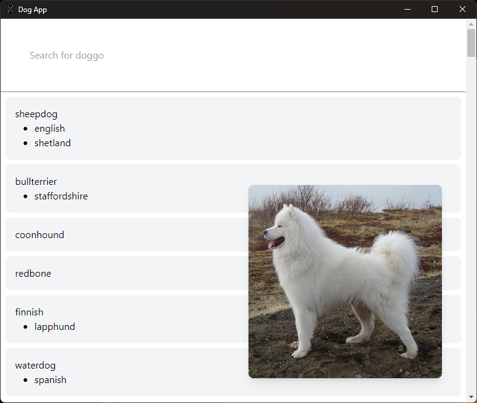

# **These examples have moved to the main dioxus repo. You can view updated versions [here](https://github.com/DioxusLabs/dioxus/tree/main/examples)**

# Example projects with Dioxus

This repository holds the code for a variety of example projects built with Dioxus.

Each project has information on how to build/deploy.

If you want to add your own, feel free to make a PR!

Current Projects:

| Example                          | Platform     | Creator     |
| -------------------------------- | ------------ | ----------- |
| [TodoMVC](./todomvc)             | Web, Desktop | @jkelleyrtp |
| [TodoMVC](./ios_demo)            | iOS          | @jkelleyrtp |
| [File Explorer](./file-explorer) | Desktop      | @jkelleyrtp |
| [E-Commerce](./ecommerce-site)   | LiveView     | @jkelleyrtp |
| [WiFi Scanner](./wifi-scanner)   | Desktop      | @jkelleyrtp |
| [Weather App](./weatherapp)      | Web          | @jkelleyrtp |
| [Dog App](./dog-app)             | Desktop      | @jkelleyrtp |

## TODOMVC (Desktop, Web)

## iOS TODOMVC 

## File Explorer (Desktop) 

## E-Commerce (Liveview)

## WiFi Scanner (Desktop)

## Weather App (Web)
[Instructions](./weatherapp/README.md/#Instructions)

## Dog App (Desktop)
[Instructions](./dog-app/README.md/#Instructions)

